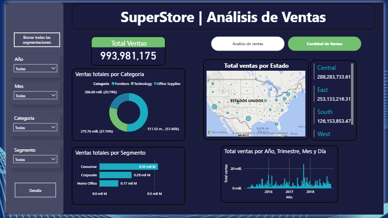
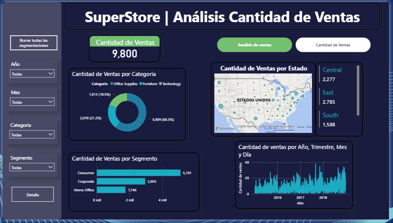
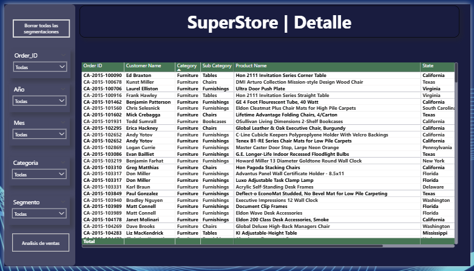

# SuperStore
# Explicacion sobre el analisis

El dashboard está compuesto por tres secciones:

Análisis de ventas: muestra indicadores de valor de ventas por categoría, segmento, región y evolución temporal.

Análisis de cantidad de ventas: presenta el número de unidades vendidas, permitiendo comparar volúmenes entre categorías, segmentos, regiones y temporal.

Detalle: tabla con el desglose de ventas a nivel de transacción.

